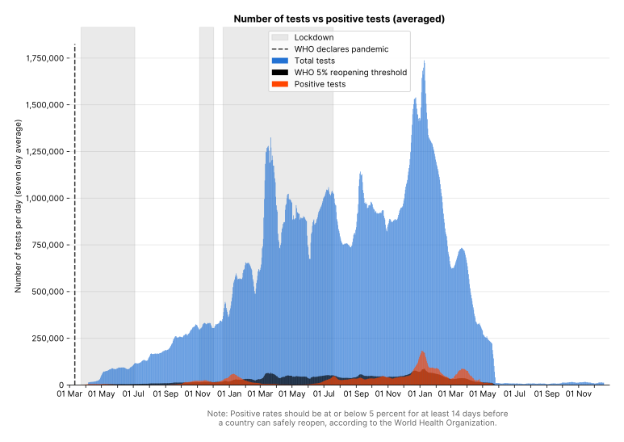
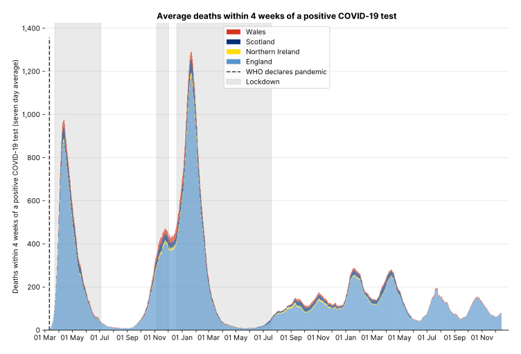
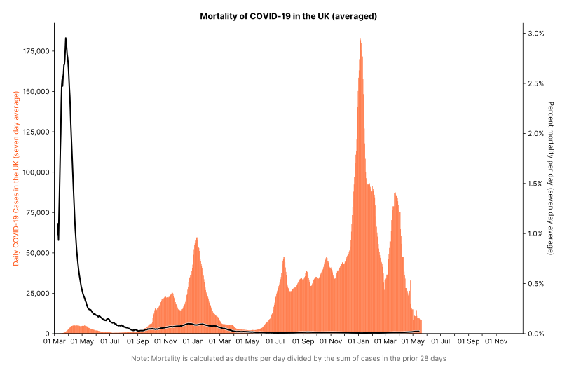
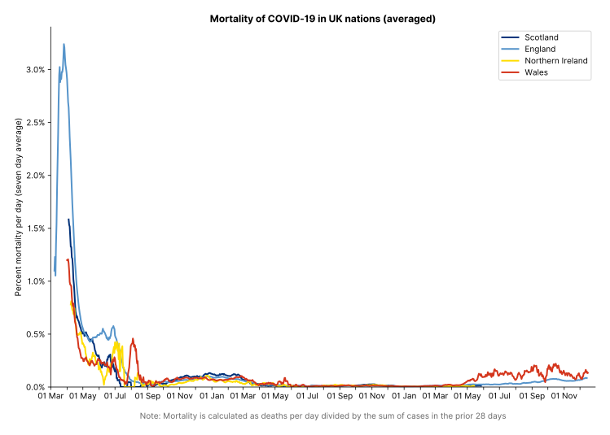

## Due to the data now being inconsistently released, I have decided to stop maintaining this repository. 

### However if you would like me to try fix some of the charts do let me know and I'll see if they can be improved :)

👉 [View all graphs](https://carlinmack.github.io/covid-graphs/)

Plots are updated daily and are available as PNG and SVG. Issues and PRs welcome. The raw data can be viewed in the `data/` directory, especially `UK.csv` and `UK.avg.csv` which is the processed output of the gov.uk data

#### Usage

If new data is available `python plot.py` will download the new data and update the plots. Use the `--help` flag for other options.

#### Contribution

It's recommended to clone the repository without the entire history: `git clone --depth 1 https://github.com/carlinmack/covid-graphs.git`

------------------------------------------------------------------------

