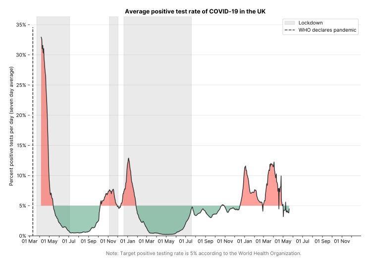
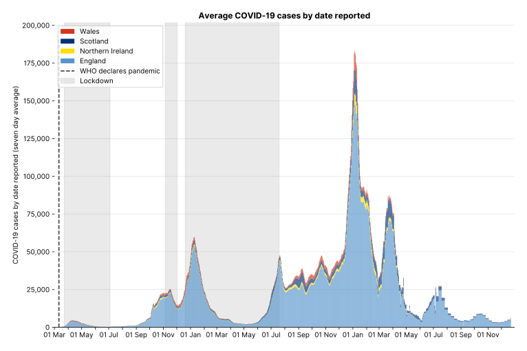
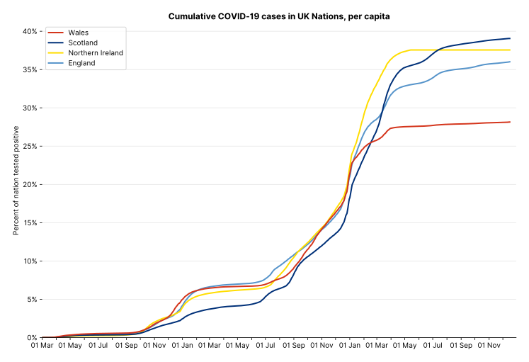
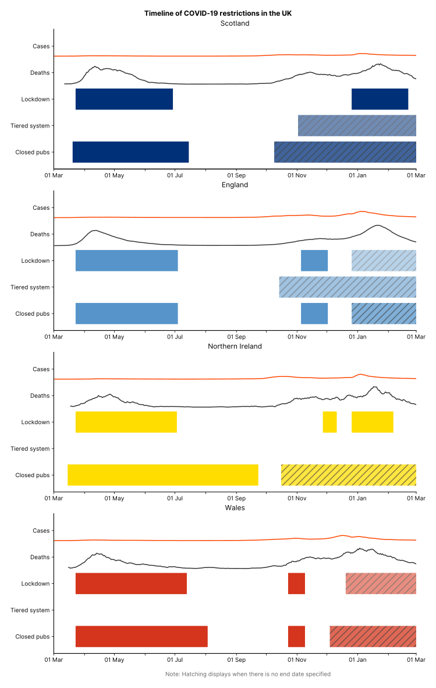

👉 [View all graphs](https://carlinmack.github.io/covid-graphs/)

Plots are updated daily, issues and PRs welcome. 

If new data is available `python plot.py` will download the new data and update the plots. Use the `--help` flag for other options.

