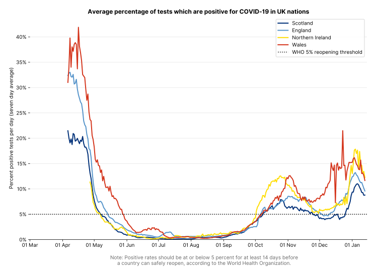

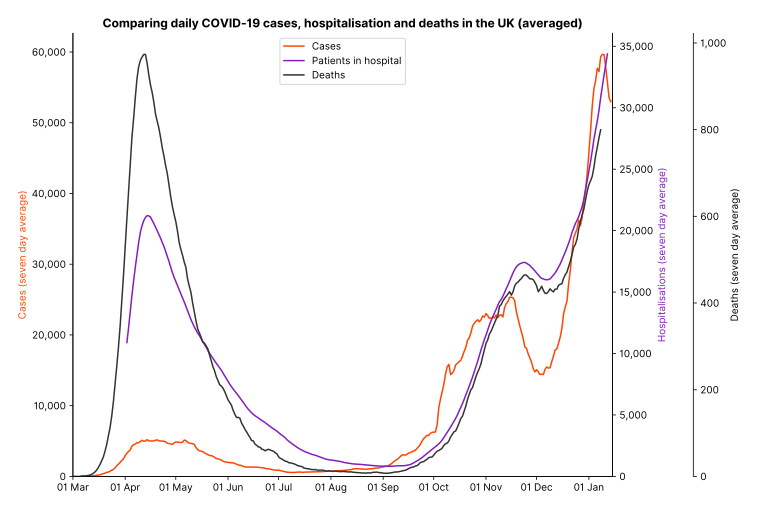

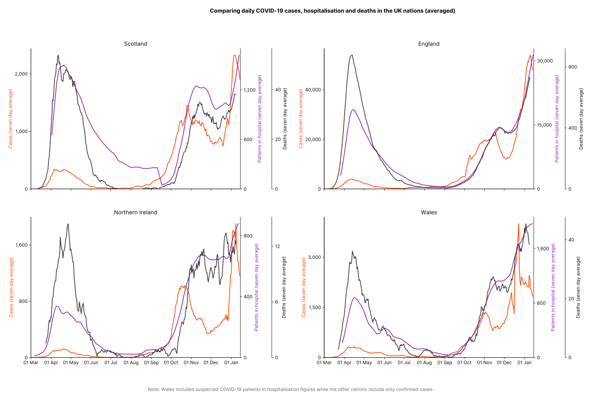

## Vaccinations

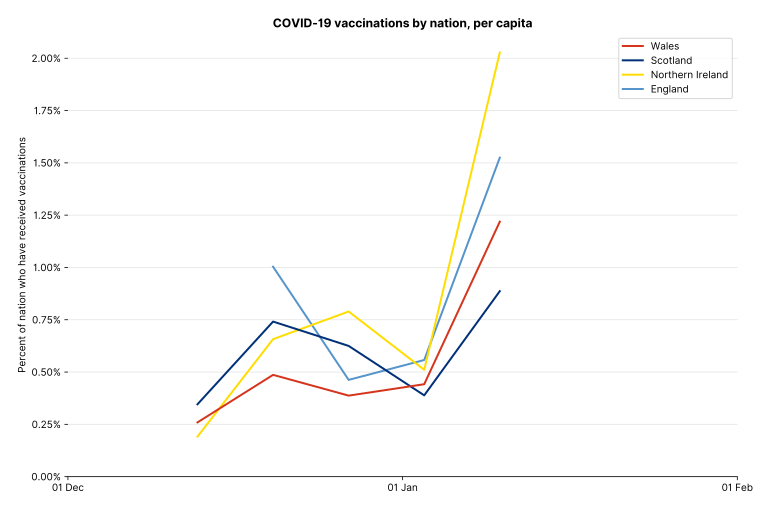

## Cases by date of specimen

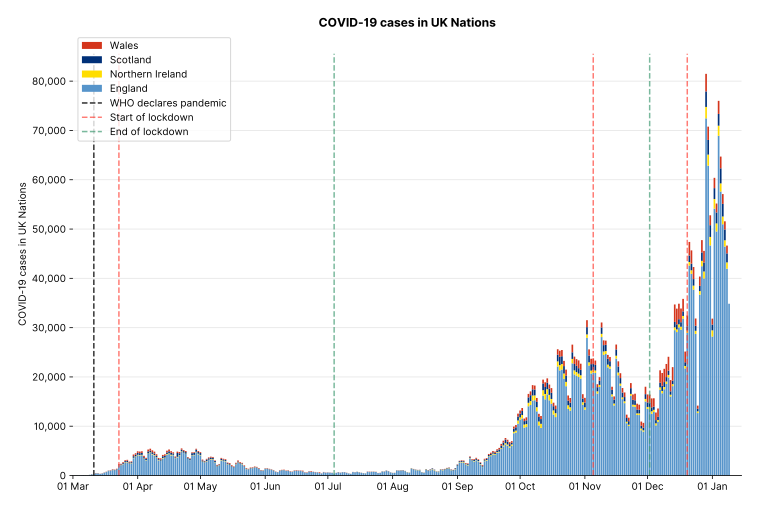

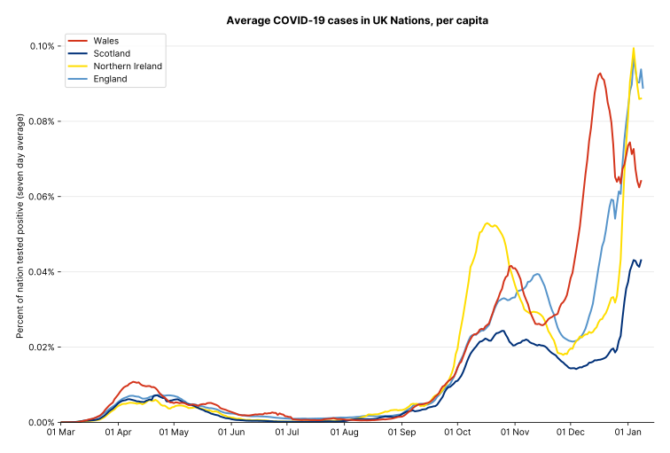

## Cases by date reported

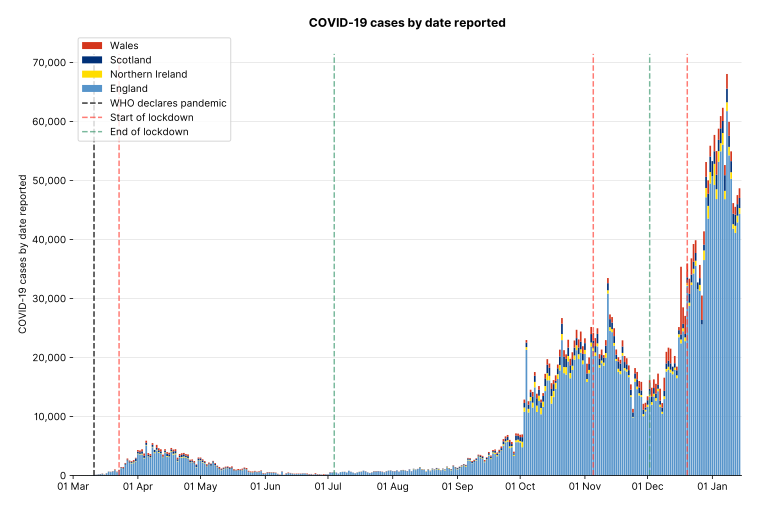

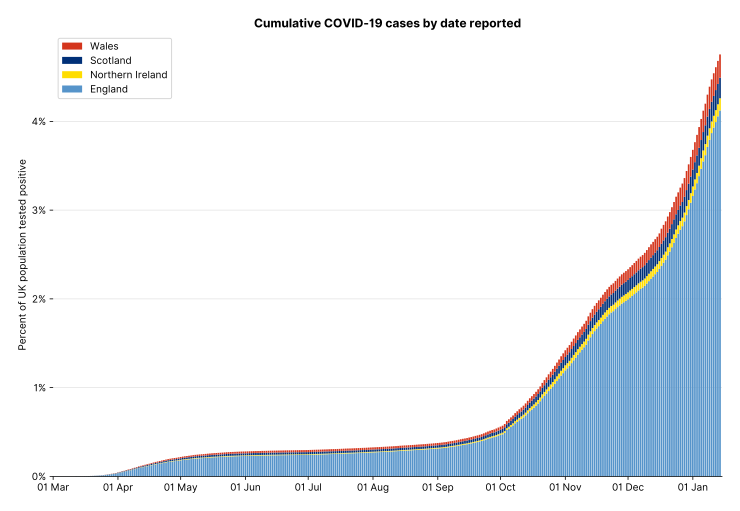

## Deaths by date of death

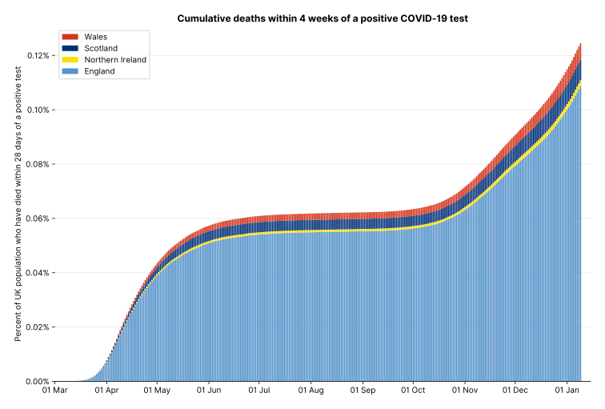

## Deaths by date reported

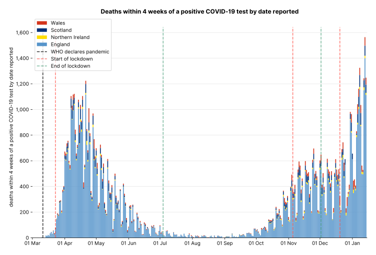

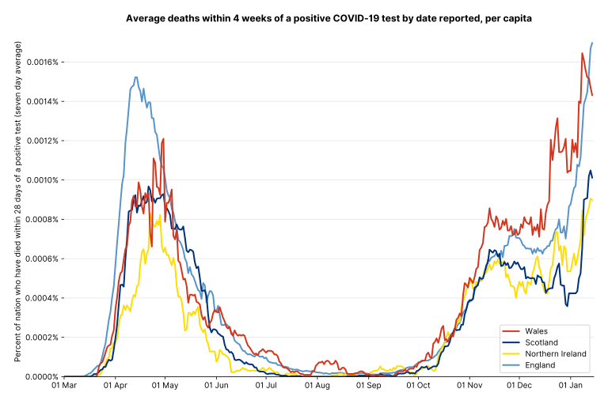
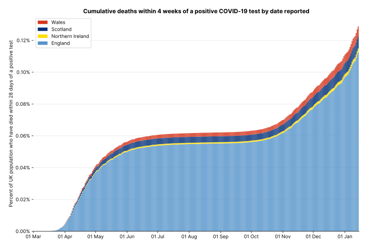
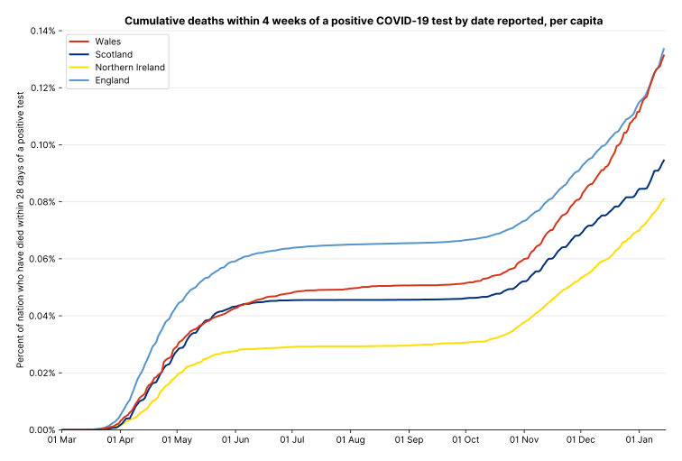

## Hospitalisations

## Ventilation beds

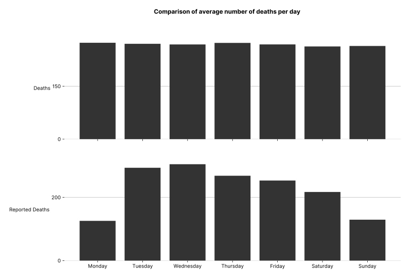

## English cases by demographics

## English deaths by demographics

